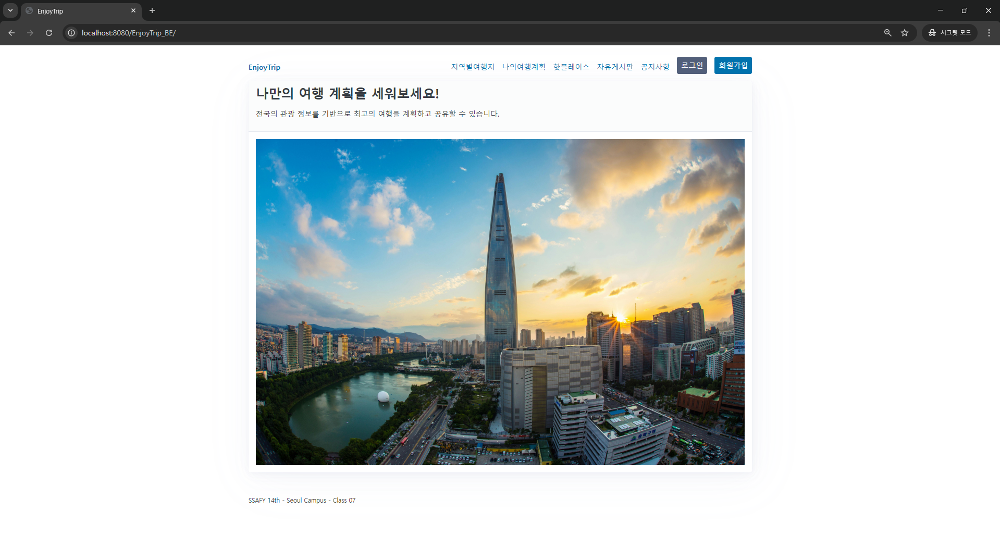
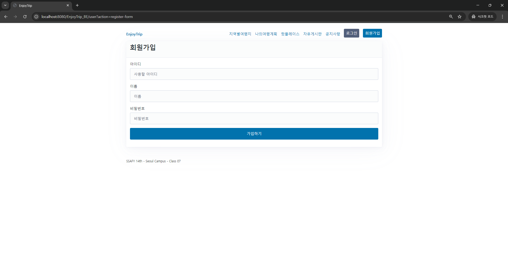
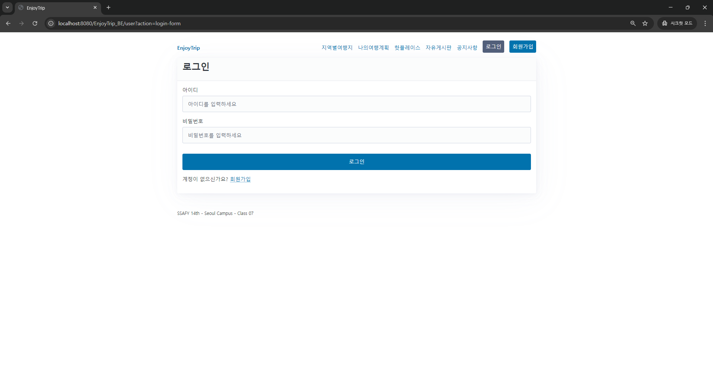
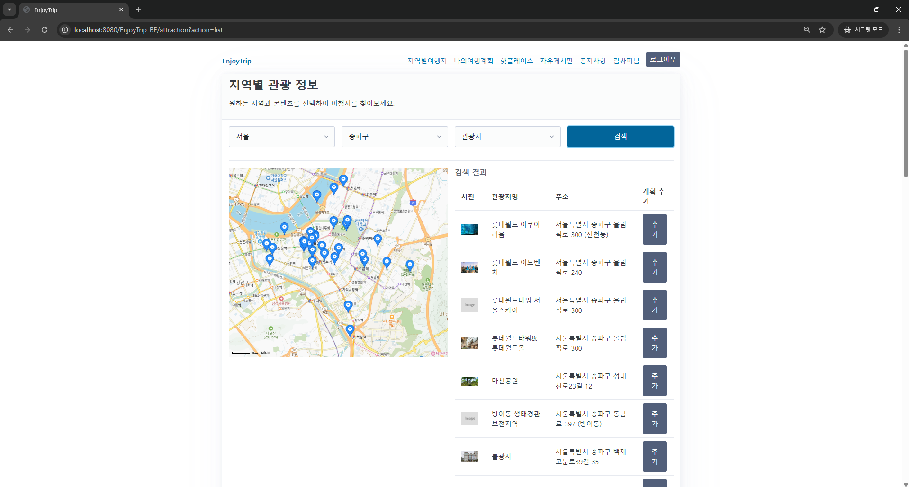
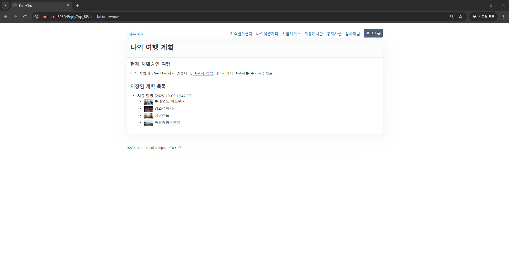
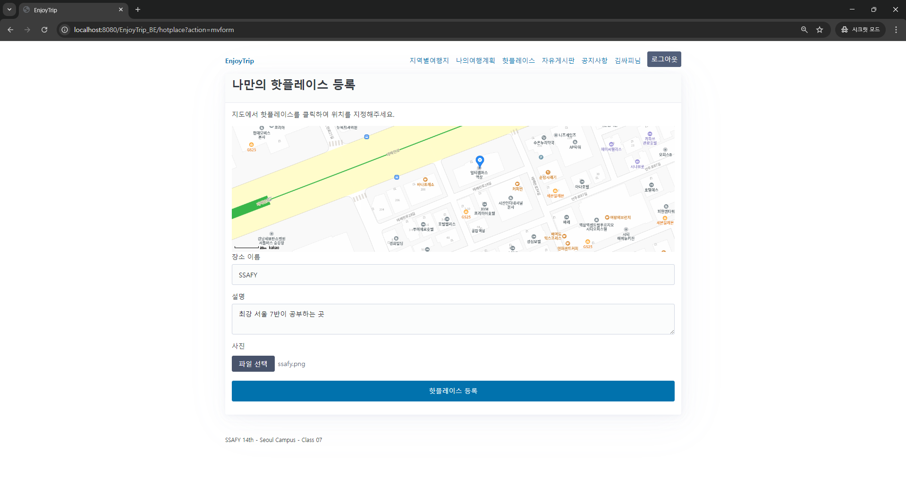
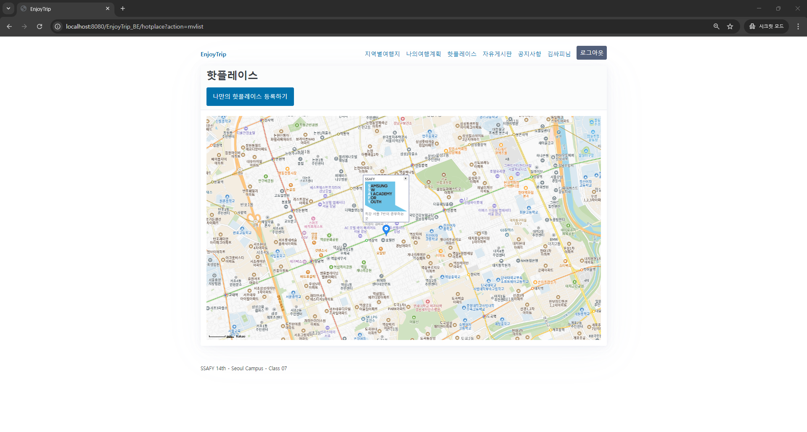
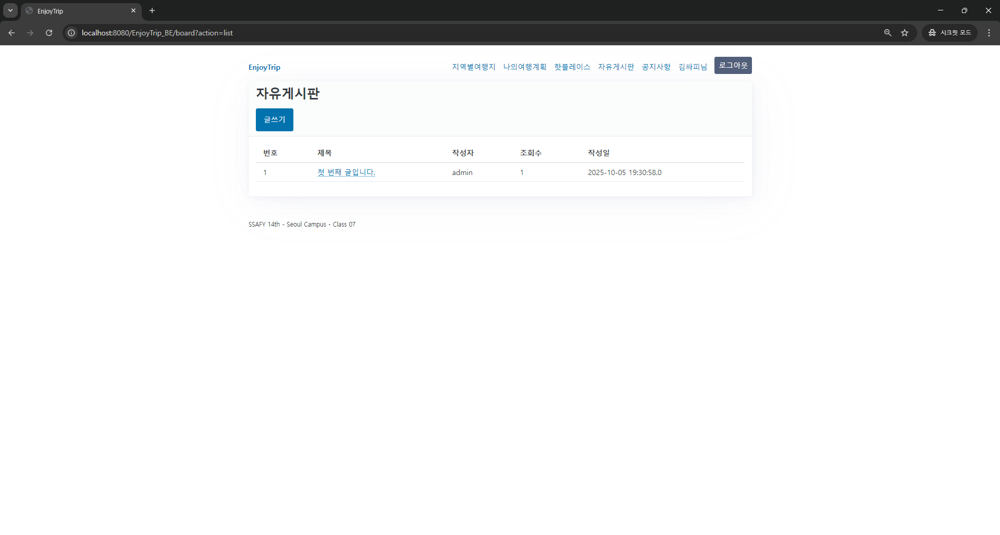
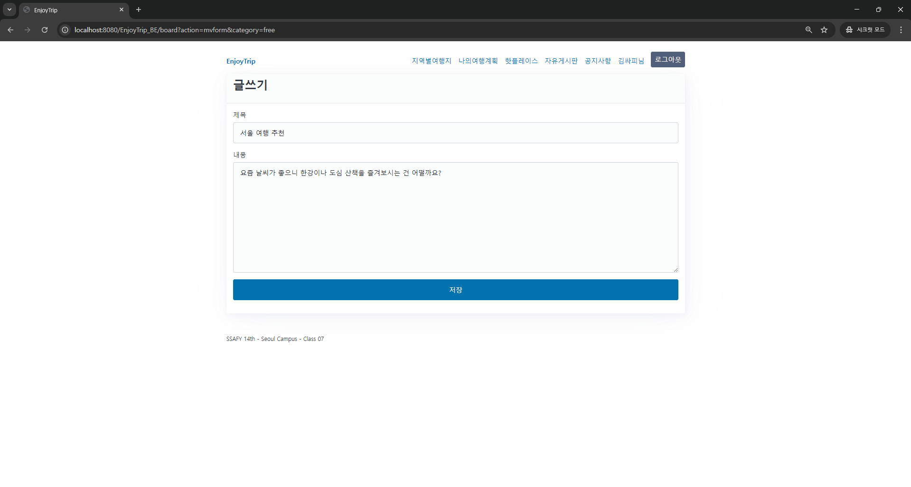

# ✈️ EnjoyTrip Backend

### 나만의 여행 계획을 세우고 공유하는 **EnjoyTrip**

EnjoyTrip은 전국의 관광 정보를 기반으로 사용자가 직접 여행 계획을 세우고, 다른 여행자들과 경험을 공유할 수 있는 커뮤니티형 웹 서비스입니다. 이 저장소는 **EnjoyTrip의 백엔드 시스템**을 위한 코드를 담고 있습니다.


---

## 💻 기술 스택

- **Backend**: Java
- **Database**: MySQL
- **Web Server**: Tomcat

---

## ✨ 주요 기능

### 🔐 로그인 및 회원 관리
- 회원가입, 로그인, 로그아웃 기능 제공
- 로그인 성공 시에만 메뉴 및 주요 서비스 접근 가능



### 🗺️ 지역별 관광 정보 조회
- 공공데이터 API 기반의 전국 관광지, 축제 정보 제공
- **리스트 뷰 & 지도 뷰**로 손쉽게 탐색 가능
- 지역 및 콘텐츠 유형별 필터링 지원  


### 📅 나만의 여행 계획
- 원하는 여행지를 선택하고 일정에 추가


### 🔥 HotPlace 공유
- 사용자 추천 장소 등록 가능
- 사진, 위치, 후기 기록
- 다른 여행자들이 공유한 HotPlace 확인 가능  



### 🗣️ 커뮤니티 게시판
- 여행 후기, 꿀팁을 자유롭게 공유
- 사용자 간 소통을 통해 여행 경험 확장\



---

## 📂 프로젝트 구조

```bash
ssafy.ps.enjoytrip_be
├─controller
│  │  MainServlet.java
│  │  UserServlet.java
│  │  BoardServlet.java
│  │  NoticeServlet.java
│  │  AttractionServlet.java
│  │  PlanServlet.java
│  └─ HotplaceServlet.java
│
├─dao
│  │  UserDao.java
│  │  BoardDao.java
│  │  NoticeDao.java
│  │  AttractionDao.java
│  │  PlanDao.java
│  │  HotplaceDao.java
│  └─ NewsDao.java
│  └─impl
│      │  UserDaoImpl.java
│      │  BoardDaoImpl.java
│      │  NoticeDaoImpl.java
│      │  AttractionDaoImpl.java
│      │  PlanDaoImpl.java
│      │  HotplaceDaoImpl.java
│      └─ NewsDaoImpl.java
│
├─domain
│  │  User.java
│  │  Board.java
│  │  Notice.java
│  │  Attraction.java
│  │  Hotplace.java
│  │  News.java
│  │  TripPlan.java
│  └─ TripCourse.java
│
├─dto
│  │  UserDto.java
│  └─ BoardDto.java
│
├─service
│  │  UserService.java
│  │  BoardService.java
│  │  NoticeService.java
│  │  AttractionService.java
│  │  PlanService.java
│  │  HotplaceService.java
│  └─ CrawlingService.java
│  └─impl
│      │  UserServiceImpl.java
│      │  BoardServiceImpl.java
│      │  NoticeServiceImpl.java
│      │  AttractionServiceImpl.java
│      │  PlanServiceImpl.java
│      │  HotplaceServiceImpl.java
│      └─ CrawlingServiceImpl.java
│
└─util
   │  DBUtil.java
   └─ ApiUtil.java

```

---

## 🛠️ 실행 방법

### 💻 로컬 개발 환경 설정 가이드

#### 1️⃣ 사전 준비
- 로컬 환경에 **MySQL 서버**가 설치되어 있어야 합니다.

#### 2️⃣ 계정 설정
- `src/main/java/ssafy/ps/enjoytrip_be/util/DBUtil.java` 파일을 열어 아래 항목을 로컬 환경에 맞게 수정하세요.
```java
private static final String USER = "SSAFY";
private static final String PASSWORD = "SSAFY";
```

#### 3️⃣ 데이터베이스 초기화
- 로컬 `MySQL` 서버에 접속하여 `src/main/resources/schema.sql` 파일을 실행하여 프로젝트에 필요한 모든 빈 테이블을 생성합니다.
- `src/main/resources/data.sql` 파일을 실행하여 관광지 정보 등의 기본 데이터를 테이블에 채워 넣습니다.
- 이 작업은 프로젝트 최초 설정 시 **한 번만** 수행하면 됩니다.
```bash
mysql -u SSAFY -p ssafy_trip < data.sql
```

#### 4️⃣ 애플리케이션 실행
- IntelliJ에서 **Tomcat 서버 설정**을 완료한 뒤, 애플리케이션을 실행합니다.
- 서버 구동 시 Listener가 자동으로 `unknown` 사용자 등 **필수 기본 데이터**를 확인 및 생성합니다.

---

## 🧑‍💻 개발 참여자

| 이름   |  GitHub  |
|:-----|:--------:|
| 정승호  | EuengHo1 |
| 서민재  |  seomj   |
